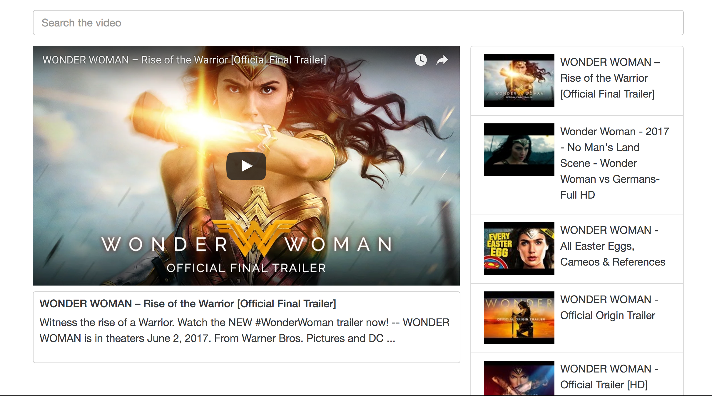

### Getting Started
<a href='https://goo.gl/C3HRaL'  target="_blank"> link to web app</a> <br>

Before you run this web app, please apply for API KEY and copy-and-paste on index.js
There is a variable called API_KEY <br>
Get the API KEY from you YouTube Data API v3
https://console.developers.google.com

Checkout this repo, install dependencies, then start the gulp process with the following:
```
> npm install
> npm start
```


You can also deploy this app into Heroku by following instruction.
For the initial deployment on Heroku using Heroku CLI.
```
> heroku login
> heroku config:set NPM_CONFIG_PRODUCTION=false
> git init
> git add .
> git commit -m 'Initial deployment on Heroku.'
> heroku create -b  <Your Heroku git repo.>
> git push heroku master
```



Notice:

Since webpack is installed as part of the devDependencies section of the package.json,
it won't run as part of a production-ready application.

This can be fixed by configuring the application with
heroku config:set NPM_CONFIG_PRODUCTION=false
then re-deploying.
